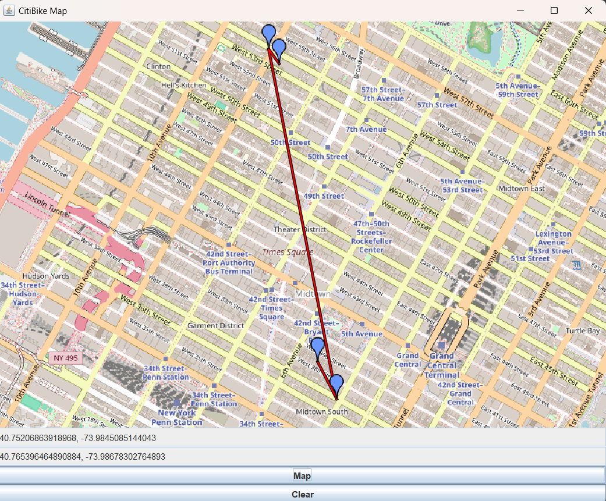

# CitiBike Service

This program takes in two location from the user: where they are and where they want to go.
The service uses these two points to find two CitiBike stations.
The first is the station that is closest to their current location that has bikes available.
The second is the station closest to their destination that has docks available.

### GUI
Allows the user to click on two locations on the map and the route will be drawn for them.
The route contains four points: the current location, the starting bike station, the ending bike station, and the destination.
When the user clicks on the "Map" button, a route is drawn between these four locations.

